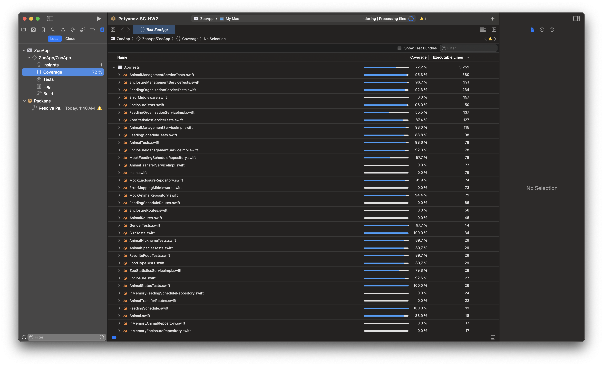

# 🦁 Zoo Management API

This is a Vapor-based web API for zoo management. It follows Clean Architecture principles and Domain-Driven Design concepts.

## 📋 Project Report

This report details the implementation according to the project requirements, focusing on functionality, architectural principles, and design concepts.

### 1. Implemented Functionality (Use Cases)

The primary required business processes have been implemented as follows:

*   **a. Add/Delete Animal:** Functionality is available through the REST API (`/animals`).
    *   **Presentation Layer:** `AnimalRoutes` handles API requests.
    *   **Application Layer:** `AnimalManagementService` contains the core logic.
    *   **Persistence:** Managed via the `AnimalRepository` interface, implemented in the Infrastructure layer (`InMemoryAnimalRepository`).

*   **b. Add/Delete Enclosure:** Functionality is available through the REST API (`/enclosures`).
    *   **Presentation Layer:** `EnclosureRoutes` handles API requests.
    *   **Application Layer:** `EnclosureManagementService` contains the core logic.
    *   **Persistence:** Managed via the `EnclosureRepository` interface, implemented in the Infrastructure layer (`InMemoryEnclosureRepository`).

*   **c. Move Animal Between Enclosures:** Implemented via the REST API (`/animals/:animalID/move`).
    *   **Presentation Layer:** `AnimalTransferRoutes` handles API requests.
    *   **Application Layer:** `AnimalTransferService` orchestrates the process, ensuring validation rules are checked.
    *   **Domain Layer:** Business rules for adding/removing animals are enforced within the `Enclosure` entity (`addAnimal`, `removeAnimal` methods). The `Animal` entity tracks its assigned enclosure (`assignToEnclosure` method).

*   **d. View Feeding Schedule:** Various read operations are available via the REST API (`/feeding-schedules`, `/animals/:animalID/feeding-schedules`, etc.).
    *   **Presentation Layer:** `FeedingScheduleRoutes` handles API requests.
    *   **Application Layer:** `FeedingOrganizationService` provides methods to query schedules.
    *   **Persistence:** Managed via the `FeedingScheduleRepository` interface, implemented in the Infrastructure layer (`InMemoryFeedingScheduleRepository`).

*   **e. Add New Feeding / Mark Completion:** Implemented via the REST API (`/feeding-schedules`, `/feeding-schedules/:scheduleID/complete`).
    *   **Presentation Layer:** `FeedingScheduleRoutes` handles API requests.
    *   **Application Layer:** `FeedingOrganizationService` contains the logic for scheduling and marking completion.
    *   **Domain Layer:** The `FeedingSchedule` entity contains the `markAsCompleted` logic.

*   **f. View Zoo Statistics:** Implemented via the REST API (`/statistics`).
    *   **Presentation Layer:** `StatisticsRoutes` handles API requests.
    *   **Application Layer:** `ZooStatisticsService` calculates statistics by querying relevant repositories.

### 2. Clean Architecture Principles Adherence

The project structure strictly follows Clean Architecture principles:

*   **(a) Layer Dependency Rule:** Dependencies flow inwards only. The `Domain` layer (`Sources/App/Domain`) has zero dependencies on outer layers (Application, Infrastructure, Presentation). `Application` depends only on `Domain`. `Infrastructure` depends only on `Domain` (for repository implementations) and `Application` (for event publishing protocol). `Presentation` depends on `Application`.

*   **(b) Dependencies via Interfaces:** Communication between layers relies on abstractions (Swift protocols) defined in the inner layers.
    *   Application services depend on repository protocols defined in the `Domain` layer (e.g., `AnimalRepository`).
    *   The `Infrastructure` layer provides concrete implementations for these protocols (e.g., `InMemoryAnimalRepository`).
    *   This allows swapping implementations (e.g., from in-memory to database persistence) without affecting the `Application` or `Domain` layers.

*   **(c) Business Logic Isolation:** Core business logic resides solely within the `Domain` and `Application` layers.
    *   **Domain Layer:** Encapsulates fundamental business rules and state within Entities (e.g., `Enclosure` validating capacity) and Value Objects (e.g., `AnimalNickname` validating format).
    *   **Application Layer:** Orchestrates use cases by coordinating `Domain` objects and repositories (e.g., `AnimalTransferService` implementing the sequence for moving an animal).
    *   The `Presentation` (API routes) and `Infrastructure` (persistence, eventing) layers contain no business logic.

### 3. Domain-Driven Design Concepts Application

Key DDD concepts have been applied to model the zoo domain:

*   **(a) Value Objects:** Primitive types are wrapped in Value Objects within the `Domain` layer (`Sources/App/Domain/ValueObjects`) to enforce validation and add domain meaning.
    *   Examples include `AnimalNickname`, `AnimalSpecies`, `FavoriteFood`, `FoodType` (validating non-empty strings), `Gender`, `AnimalStatus`, `EnclosureType`, `Size` (enums representing specific domain states/types), and `EntityID` (typealias for `UUID`).

*   **(b) Encapsulation of Business Rules:** Business rules are encapsulated within the relevant Domain Entities (`Sources/App/Domain/Entities`).
    *   `Enclosure`: Manages its animal list, enforcing capacity limits (`addAnimal`) and preventing adding duplicate animals.
    *   `Animal`: Manages its health status (`heal`).
    *   `FeedingSchedule`: Manages its completion status (`markAsCompleted`).
*   **Rich Domain Model:** Entities (`Animal`, `Enclosure`, `FeedingSchedule`) contain both data and the behavior associated with that data.
*   **Repositories:** Abstraction for data access defined in `Domain` (`Sources/App/Domain/Repositories`), implemented in `Infrastructure`.
*   **Application Services:** Encapsulate use cases in the `Application` layer (`Sources/App/Application/Services`), interacting with the domain model.
*   **Domain Events:** Key events like `AnimalMovedEvent` and `FeedingTimeEvent` are defined in the `Domain` (`Sources/App/Domain/Events`) and published by Application Services via an `EventPublisher` interface, allowing for decoupled responses to domain changes.

### 4. Persistence

*   Data storage is implemented using simple in-memory repositories within the `Infrastructure` layer (`Sources/App/Infrastructure/Persistence/InMemory`), fulfilling the requirement for non-persistent storage.

### 5. Testing

The project includes unit tests covering different layers:
*   **Domain Layer:** Tests ensure entities and value objects behave correctly.
*   **Application Layer:** Service logic is tested using mock repositories to isolate behavior.
*(Note: Specific code coverage percentage can be inserted here after running coverage tools.)*

## 🚀 Project Setup & Launch

1.  Ensure Swift and Vapor are installed.
2.  Navigate to the project root directory.
3.  Build the project: `swift build`
4.  Run the application: `swift run App serve --hostname 0.0.0.0 --port 8080`
5.  The API will be available at `http://localhost:8080`.

## 🧪 Running Tests

1.  Navigate to the project root directory.
2.  Run tests: `swift test`
